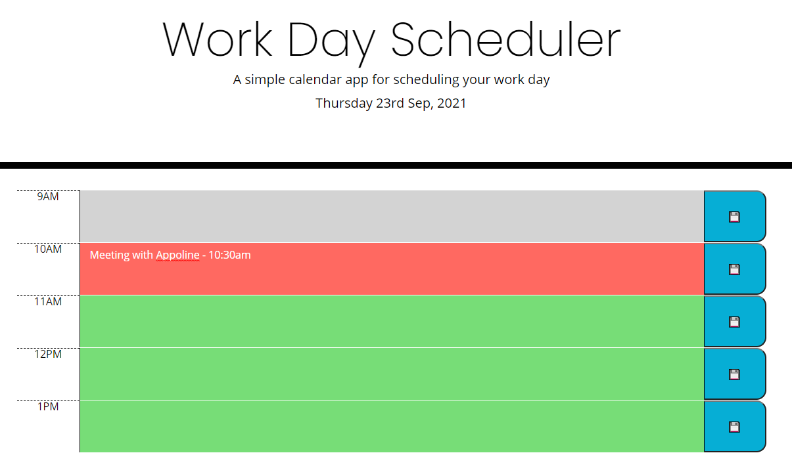

## Work Day Planner

Work Day Planner is used to enter in tasks or memos for the dat. 
It will display the current date at the top of the screen, and the colours of the text field will be updated according to the time of the day. 
The memo will be saved in local storage if the user clicks on the Save button. 

# Preview of the planner

# Deployed application

https://annanguyen1.github.io/Work-Scheduler/

